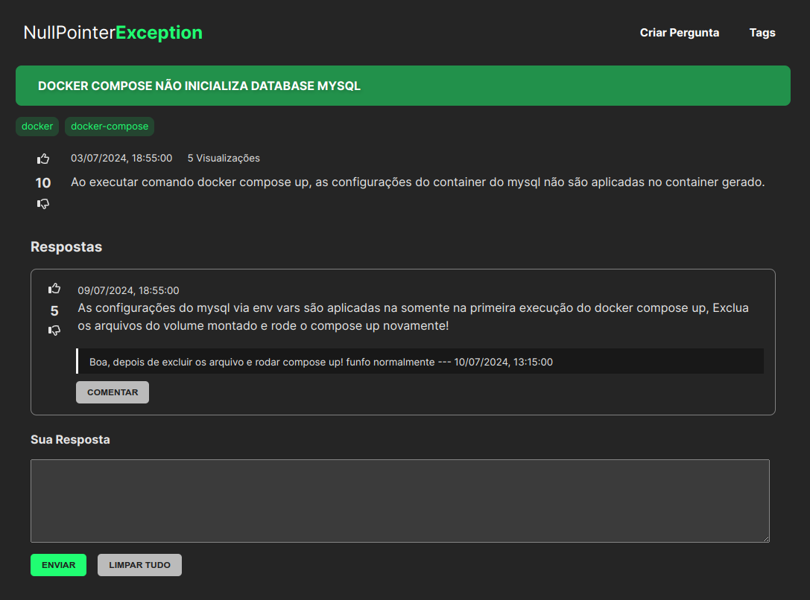

## NullPointer



### Stack

Java & Spring Boot | React & TypeScript | MySQL | Docker

### Releases

```
v0.1.0
- MVP capacidade de criar perguntas, responder perguntas e comentar respostas.
```

## Executando

- `Via Docker Compose`

```sh
docker compose up -d
```

- `Ou Localmente`

    - __Back-end__: Será necessário banco de dados configurado, de preferência do manifesto do docker compose

        ```sh
        docker compose up mysql -d
        ```

        - Iniciar Spring Boot, necessário exportar variavel de ambiente __WEBAPP_BASE_URL__ com endereço de host e porta, de onde roda o frontend para liberação do cors. E outra variavel __DB_HOST__ caso precise informar um endereço de host e porta do banco de dados diferente.

        ```sh
        export WEBAPP_BASE_URL=http://localhost:9000 DB_HOST=localhost:3306
        ./src/api/./mvnw clean spring-boot:run -f ./src/api/pom.xml
        ```

    - __Front-end__: Necessário instalar depedências do frontend dentro do diretório `./src/web`

        ```sh
        cd src/web
        yarn install 
        ```

        - Iniciar script _dev_, onde também será necessário exportar variável de ambiente __API_BASE_URL__ com host e porta, endereço que o frontend irá consumir.

        ```sh
        export API_BASE_URL=http://localhost:8000/api
        yarn --cwd ./src/web/ dev
        ```

## Endpoints

| Serviço | Endereço | 
| --- | --- |
| Frontend | [http://localhost:9000](http://localhost:9000) |
| Backend | [http://localhost:8000/api/perguntas](http://localhost:8000/api/perguntas) |
| Database UI | [http://localhost:5000](http://localhost:5000) |
| Database Server | localhost:3306 |